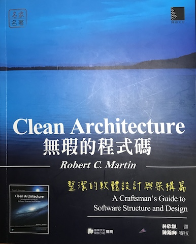

---
layout: post
title: 筆記心得 Clean Architecture 無瑕的程式碼 0
--- 

上週老爸老媽來幫忙小朋友開學，無暇記錄一些東西。

Clean Architecture 這本七月初買到現在，才看了一半。不過時間有限，若能持之以恆地看完，就很開心了！

老實說我沒有看過 Bob 大叔前幾個作品，之所以會看這本，是因為我對程式開發的架構設計充滿了想像。

# 如何保有變動的彈性？

過去 app 的開發，還只是維持 [開案] > [討論/設計] > [實作] > [測試] > [結案] 的流程時。每當要跑下一個 run 時，[討論/設計] 往往會被上一輪的實作限制很多。

> 企劃/設計：可以把這個頁面換到這裡嗎？然後原本了流程中間多一個畫面來增加...
>
> 開發：不行拉！如果這樣改就是大動，另外兩邊的流程也跟這裡的實作有關，幾乎要重寫...
>
> 測試：如果要重寫或是大改，那這樣測試時間就要增加...
>
> 企劃/設計：...

當然這樣的問題有很多種解法。像是開發前充分討論，敏捷開發，更小的實作來遞迴工作流程...。但是回過頭來，我想到的是，如果當時架構就已經是不堪修改的，那討論再多，流程再敏捷，似乎也無法解決，工程師要大修改，測試風險增加，整體開發時間增加。

> 前期討論有助於不必要的規格開發，但好的架構才能降低改動的時間與風險

從 2011 年以來，在 iOS app 圈打滾，有這樣的的深刻體驗與感觸。**設計 / 程式實作 / 測試，彼此間的耦合性太高，很難讓彼此有好的發揮**。

# 相依性的問題

雖然說這本書比較探討程式碼上面的架構問題，但延伸到更上層的開發流程裡，[設計] 與 [程式實作] 間，也應該要保留好降低耦合的接口，讓討論兩方能就[接口]充分討論，但是雙方能在各自的領域全力發揮。

先回到程式面，程式設計師至少先能做到讓彼此間的耦合降低，讓修改時能降低風險，讓測試能更順利進行。

# 準備開始撰寫心得

看了這本書之後，發現過去有些還不太清楚的概念，有了一些解答。過去一些想法，也獲得了印證。我想裡面有些精華，需要我慢慢的咀嚼保留下來ＸＤ....

待續...

第一章： [什麼是設計與結構](2018-09-04-CleanArchitecture-2.md)

第二章： [兩種價值觀的故事](2018-09-05-CleanArchitecture-3.md)

第三章： [範式概述](2018-09-04-CleanArchitecture-4.md)

btw 這個譯者我覺得翻得還不錯，一些編註的部分講得很仔細！

